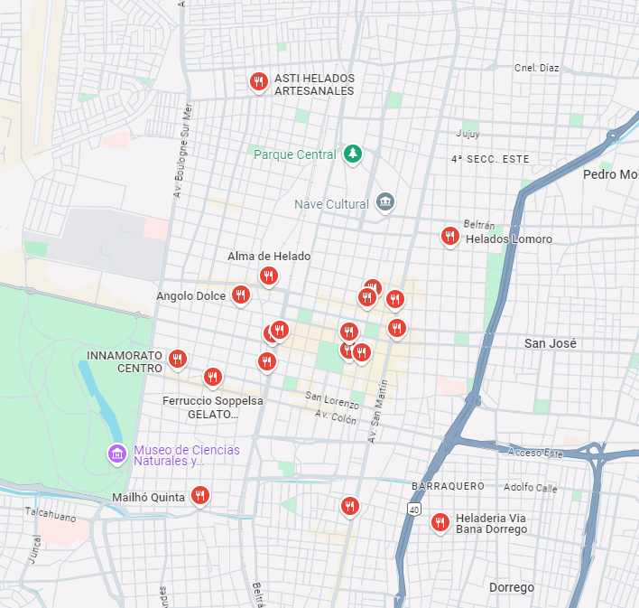
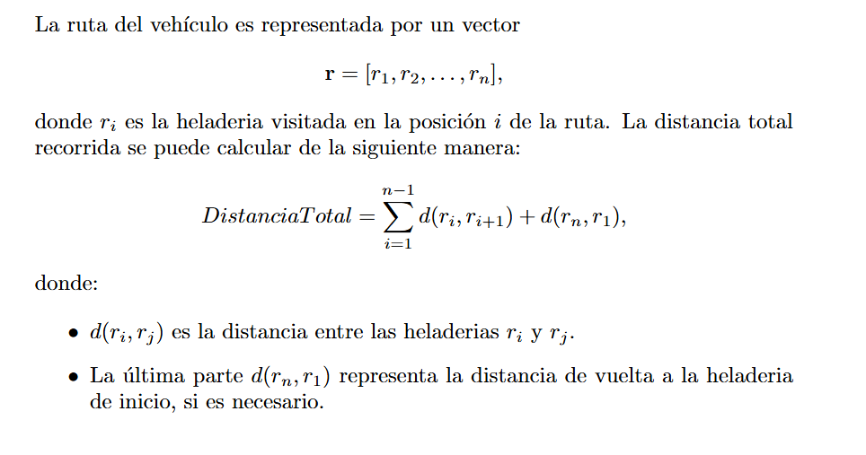
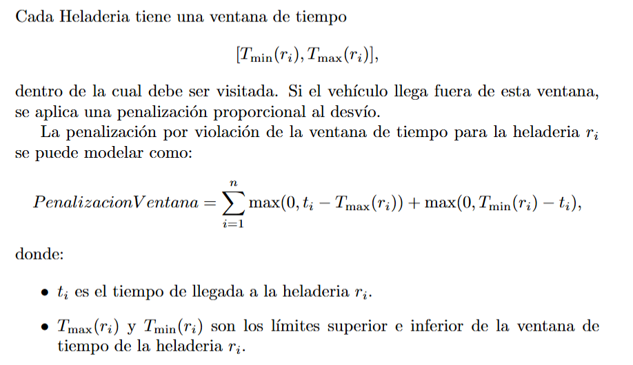
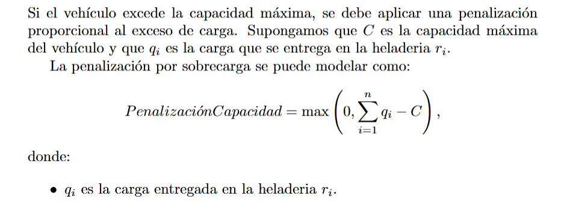
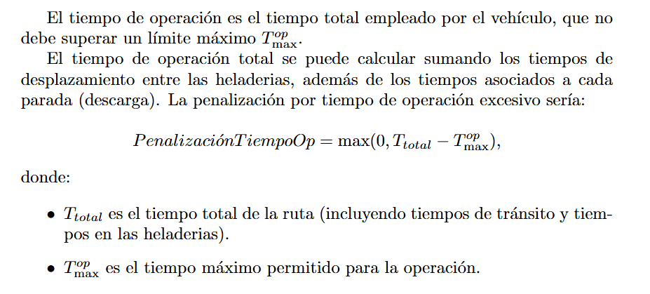
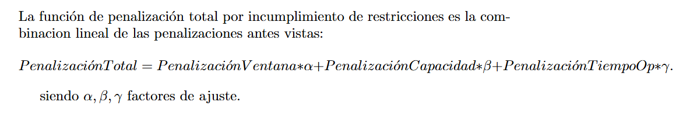
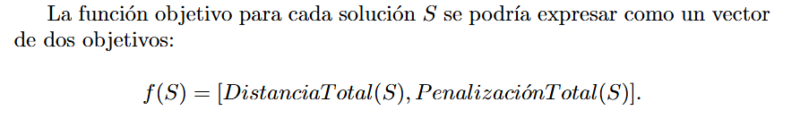

# Optimizacion de rutas para entregas a Heladerias

## Código de Proyecto
**Hela2**

## Descripción
Este proyecto tiene como objetivo el desarrollo de un algoritmo genético (AG) para optimizar las rutas de entrega dentro de un sistema logístico de heladerías. Se busca generar rutas eficientes teniendo en cuenta varios factores como la distancia, las ventanas de tiempo, la capacidad de los vehículos y el horario de circulacion del vehiculo.

### Objetivos del Proyecto
Desarrollar un algoritmo genético que genere rutas óptimas para un conjunto de entregas donde se buscara:
- Minimizar la distancia de las rutas generadas.
- Cumplir con las ventanas de tiempo.
- Demanda total atendida por el vehiculo no exceda su capacidad.
- Tiempo que pasa fuera de su depósito no debe exceder su capacidad de tiempo. 

### Deseable
- El vehiculo puede restablecer su stock pasando por cualquier depósito. (implementar mas depositos)

(En caso de poder implementar el uso de mas de un vehiculo)
- Minimizar el número de vehículos 
- Determinar qué clientes deben ser atendidos por cada vehiculo desde cada depósito

### Alcance
El proyecto se enfocará en un conjunto de datos representativo de un sistema de entrega ficticio; sin embargo, si se obtienen los datos necesarios, es posible adaptarlo a un escenario real.

### Limitaciones
- El algoritmo se evaluará solo en escenarios simulados.
- La implementación no abordará variables externas como el tráfico en tiempo real.

## Justificación
Se emplea el uso de la programacion Evolutiva debido:
1. **Exploración de un Gran Espacio de Soluciones**: El TSP, y más aún con restricciones, tiene un espacio de soluciones muy amplio. La programación evolutiva es útil para explorar múltiples rutas de forma paralela, buscando combinaciones óptimas de manera más efectiva que con métodos de optimización exacta.

2. **Adaptabilidad a Restricciones Complejas**: Los algoritmos evolutivos pueden adaptarse bien a múltiples restricciones, como los horarios de apertura y tiempos de descarga, sin tener que modificar drásticamente la estructura del algoritmo. Se puede incluir estas restricciones en la función de fitness, penalizando soluciones que violen los límites de horario.

3. **Optimización Multiobjetivo**: Los algoritmos genéticos son especialmente útiles para problemas multiobjetivo y pueden ayudarte a encontrar soluciones balanceadas entre los distintos factores.

4. **Flexibilidad de Operadores Genéticos**: Operadores como el cruce y la mutación son personalizables, y puedes ajustarlos a la necesidad del problema, permitiendo una exploración más amplia y diversificada del espacio de búsqueda.

### Función Fitness
La función de fitness determinará qué tan buena es una solución (una secuencia de rutas). Tendrá en cuenta lo siguiente:

Funcion objetivo 1 - Minimizar la distancia total recorrida

Funcion Objetivo 2 - Minimizar el incumplimiento de penalizaciones

Penalizaciones:
- Penalizacion por incumplimiento de ventana de tiempo : Si el vehiculo llega fuera de la ventana de tiempo de cualquier cliente, la solución debe penalizarse.

- Penalizacion por capacidad maxima del vehiculo: Se asegura de que la carga total que transporta el vehiculo en cualquier momento no exceda su capacidad máxima.

- Penalizacion por tiempo de operacion: Asegúrate de que el tiempo que el vehiculo pasa fuera del depósito no exceda un límite máximo.

#### Si se resuelve como una sola funcion objetivo
Se realiza una combinacion lineal entre la funcion de distancia maxima y la de penalizacion con factores de ajusta para ponderar la relevancia de cada uno

#### Si se emplea multiobjetivo

### Metricas
#### Objetivo
El valor de la funcion objetivo cuanto menor sea mejor, buscando ver si converge o en otras palabras funcion objetivo no disminuye demasiado a lo largo de las iteraciones
#### Multiobjetivo
Al ser multiobjetivo se llega a un punto donde una solucion no puede ser mejorara sin emporar otra (Frontera de Pareto) 
- Hypervolume 

####

## Listado de actividades a realizar

## Bibliografía
Ant Colony Optimization for Multi-objective
Optimization Problems 
https://hal.science/hal-01502167/document