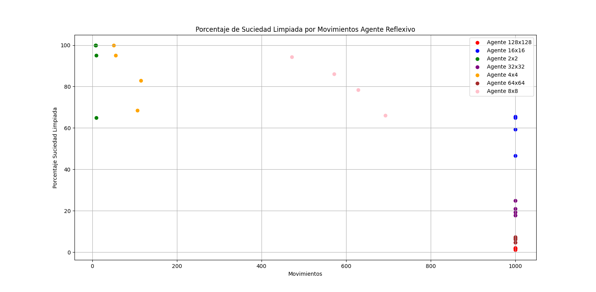
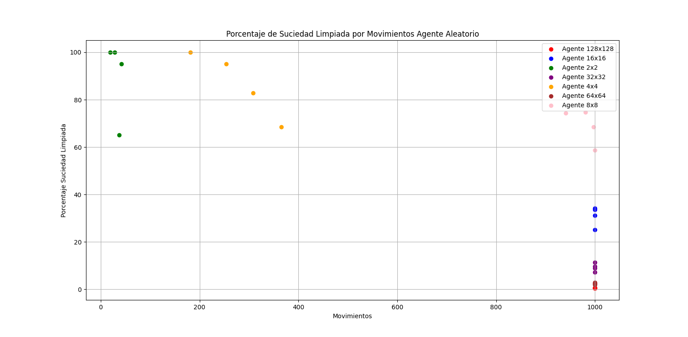
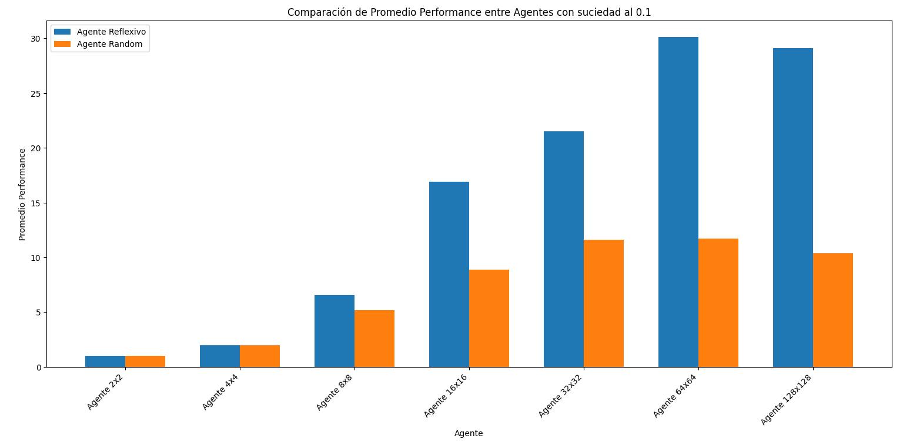
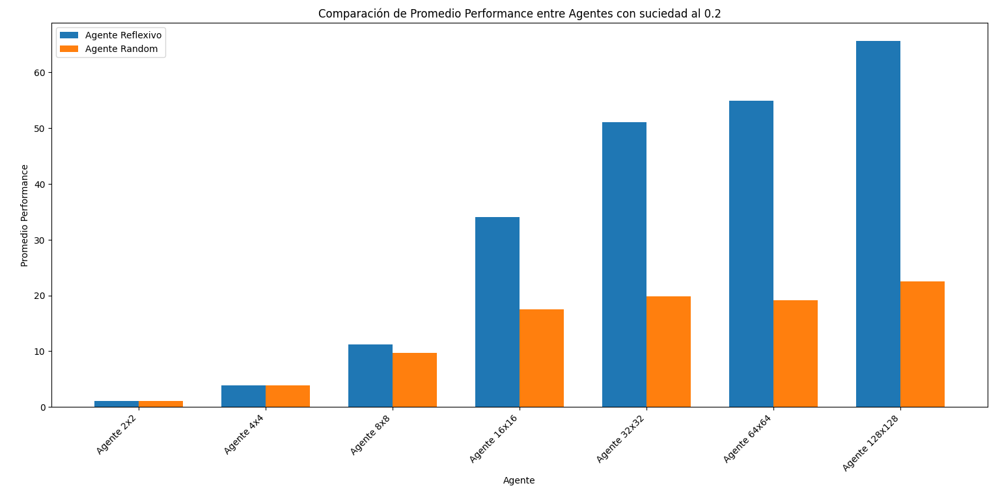
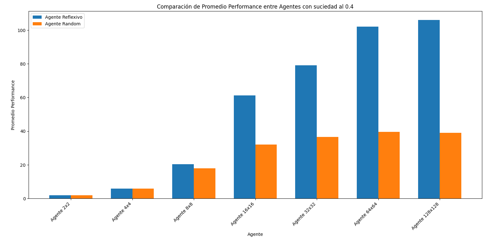
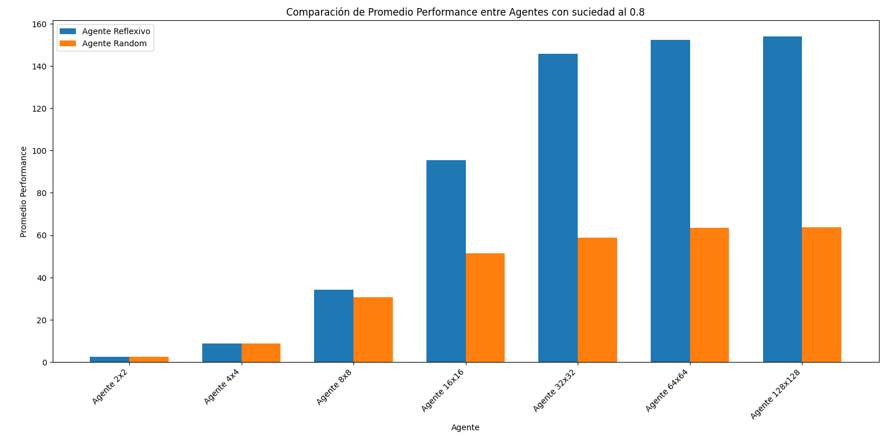
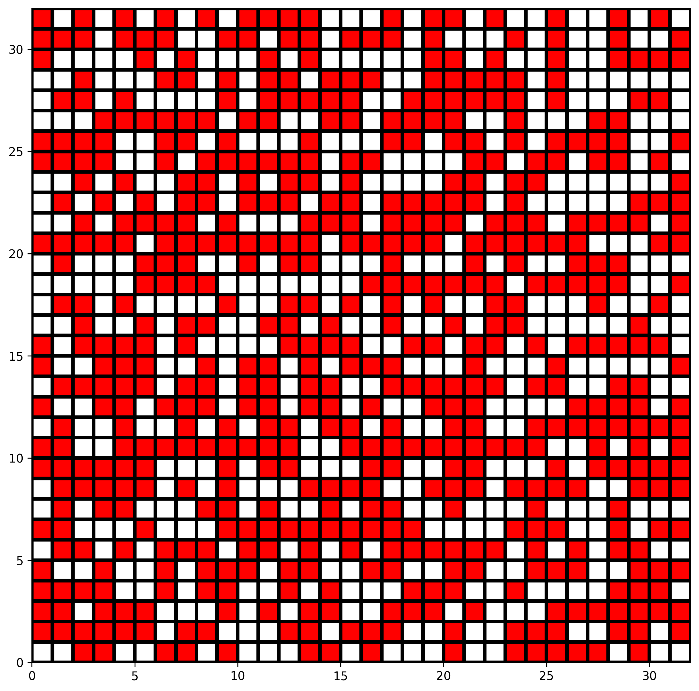
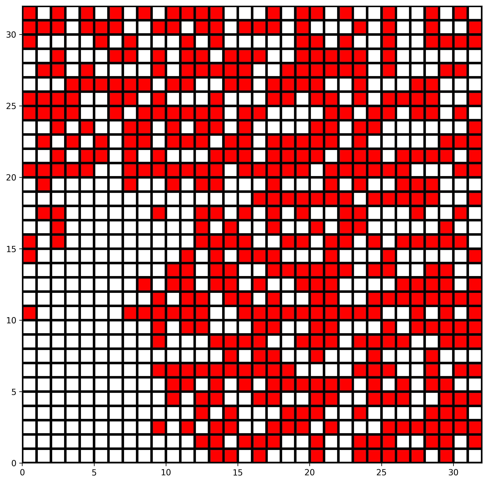
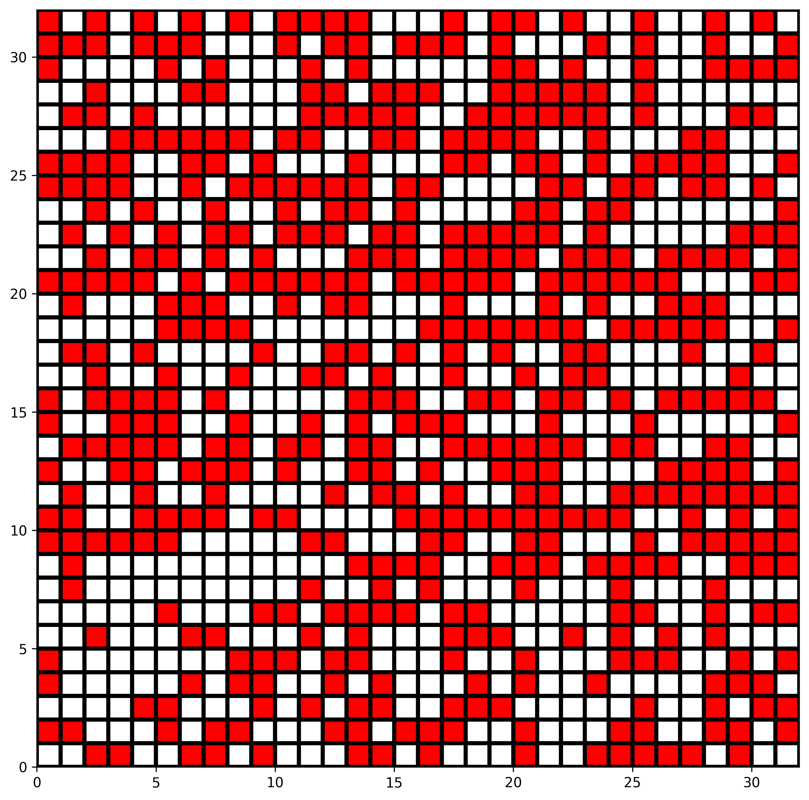

## **Introducción**

Se presenta como objetivo evaluar el desempeño de agentes racionales en un entorno de simulación basado en el mundo de aspiradora. La tarea principal del agente es limpiar la suciedad en un entorno determinado. Se realizarán experimentos con diferentes configuraciones de entorno para comparar el rendimiento del agente y determinar las configuraciones más eficientes.

## **Marco teorico** 

El entorno de simulación del mundo de aspiradora se compone de un espacio rectangular donde cada celda puede estar limpia o sucia. Un agente racional se mueve por este entorno con el objetivo de limpiar la mayor cantidad de celdas con la menor cantidad de movimientos posible. 

### **Elementos principales:**
- **Agente:** Entidad que percibe el entorno y toma decisiones, se usara un agente reflexivo con una simple regla, si la casilla esta sucia, limpia de lo contrario realiza otra accion y un agente totalmente aleatorio en su toma de decisiones.
- **Entorno:** Representado como una cuadrícula, con celdas que pueden estar sucias o limpias.
- **Métricas de rendimiento:** Se mide por la cantidad de celdas limpiadas.

## **Diseño experimental**
Los experimentos se diseñaron para medir el rendimiento del agente bajo diferentes condiciones de entorno.
1. **Tamaño del entorno:** 2 × 2, 4 × 4, 8 × 8, 16 × 16, 32 × 32, 64 × 64, 128 × 128.
2. **Porcentaje de suciedad:** 10%, 20%, 40%, 80%.

Se realizaron 10 escenarios por cada tamaño del entorno y porcentaje de suciedad para tener mas fiabilidad de los datos donde ambos agentes se pusieron a prueba.

## **Análisis y Discusión de Resultados**
Un grafico de dispersion para observar en general la sucieda limpiada.

se puede ver que a partir del escenario 8x8 ambos agentes ya no pueden limpiar la totalidad del escenario 

Los gráficos a continuación muestran el promedio de puntos por agente bajo las diferentes configuraciones de suciedad del escenario:

Se puede observar que a partir del escenario 8x8 los agentes reflexivos tienen una mejora significativa en la limpieza de suciedad comparada con los agentes aleatorios, pero esta mejora queda delimitada por la cantidad de movimientos donde se puede apreciar que la diferencia entre el entrono 64x64 y 128x128 no hay mucha diferencia.

## Ejemplo de una simulacion
Se presenta el mapa de una de las simulaciones en un entorno 32x32 con un nivel de suciedad 0.8

Mapa en el cual los agentes se desenvolveran

Mapa despues de que el agente reflexivo realizo su simulacion

Mapa despues de que el agente aleatorio realizo su simulacion

## **Conclusiones**
Podemos concluir que el agente reflexivo con una simple regla es superior a la hora de limpiar un entorno conrespecto a uno totalmente aleatorio