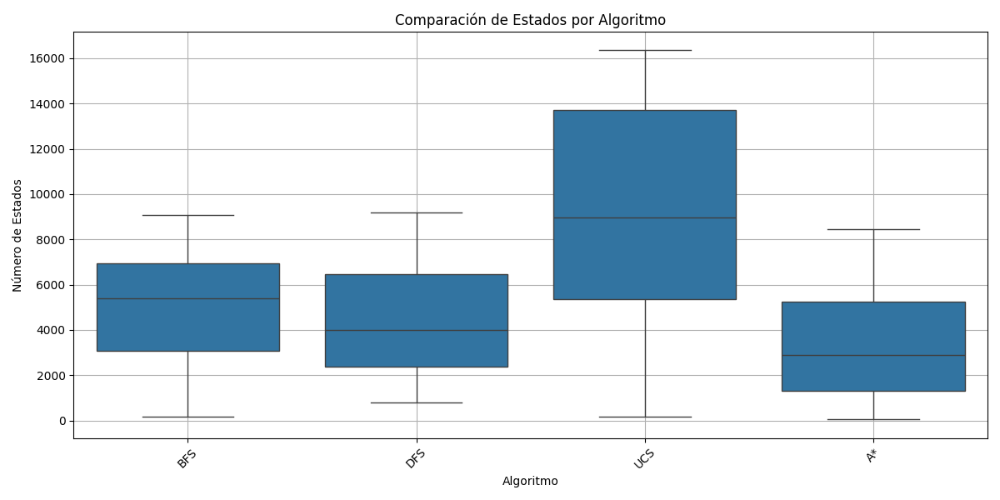
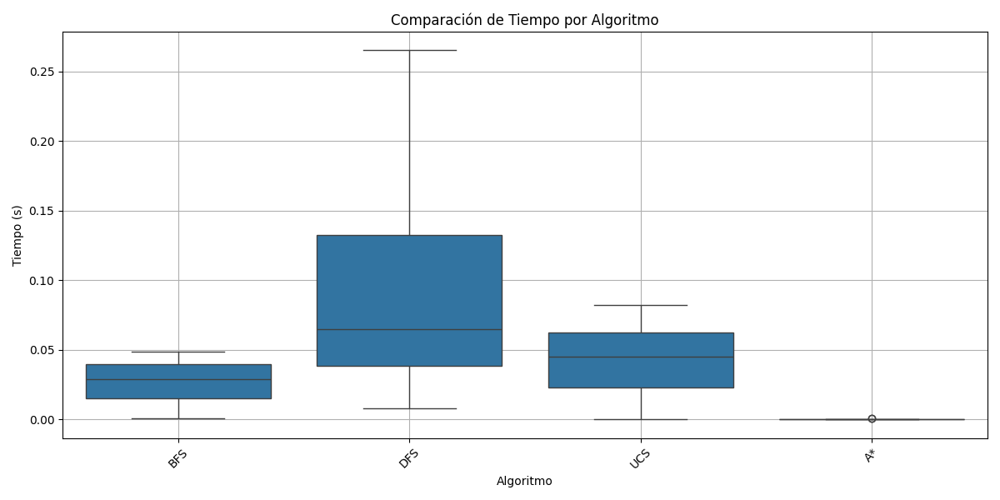
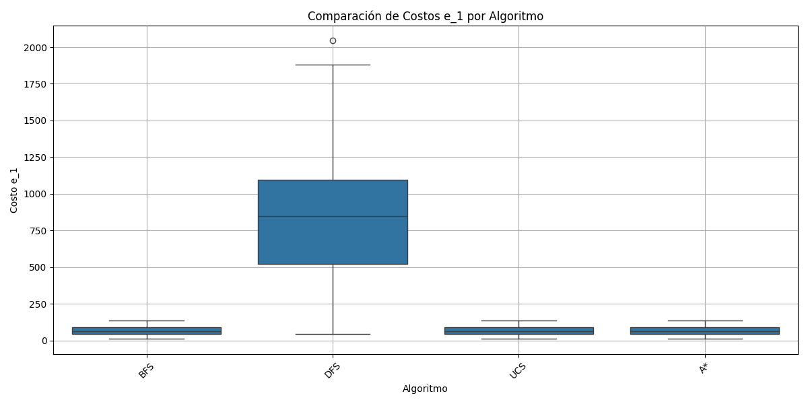
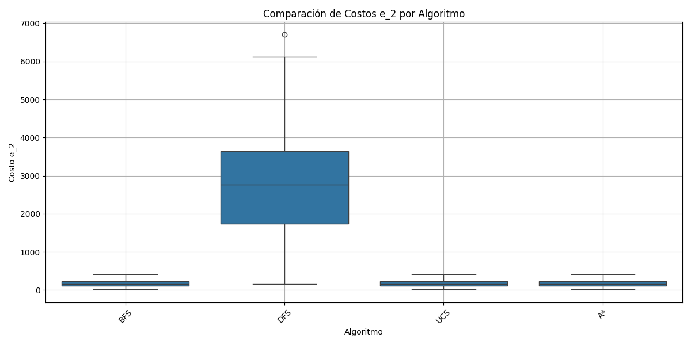

# Introduccion
Con el proposito de comparar el rendimiento de distintos algoritmos de busqueda se utilizo el entorno de Frozen Lake donde se ejecutaran estos algoritmos

# Marco Teorico 
Frozen Lake es un entorno de simulación en una cuadrícula donde un agente debe moverse desde un punto de inicio hasta una meta a través de un lago congelado. Debe evitar caer en agujeros (casillas peligrosas) que aparecen de manera aleatoria. El agente puede moverse en cuatro direcciones (izquierda, abajo, derecha, arriba).

Los algoritmos a ejecutar en el entorno son:
    
#### Búsqueda No Informada
La búsqueda no informada se refiere a algoritmos que exploran el espacio de estados sin información adicional sobre la distancia o el costo hasta el objetivo. Entre los algoritmos analizados se encuentran:
- **Búsqueda por Anchura (BFS)**: Explora todos los nodos en un nivel antes de pasar al siguiente.
- **Búsqueda por Profundidad (DFS)**: Explora tan profundo como sea posible antes de retroceder.
- **Búsqueda de Costo Uniforme (UCS)**: Expande el nodo con el costo más bajo, considerando el costo de las acciones.
- **Búsqueda por Profundidad Limitada**: Similar a DFS, pero con un límite en la profundidad de búsqueda.
- **Aleatorio** : Realiza acciones aleatorias.

#### Búsqueda Informada

La búsqueda informada utiliza heurísticas para guiar la exploración del espacio de estados, lo que permite encontrar soluciones de manera más eficiente que las búsquedas no informadas. Este tipo de búsqueda aprovecha información adicional sobre la distancia o el costo al objetivo. El algoritmo principal analizado en este trabajo es:

*   **Algoritmo A***: Este algoritmo combina la búsqueda de costo uniforme y la heurística para expandir nodos. Utiliza una función de evaluación \( f(n) = g(n) + h(n) \), donde:
    - \( g(n) \): costo desde el inicio hasta el nodo \( n \).
    - \( h(n) \): estimación del costo desde el nodo \( n \) hasta la meta (heurística).
    
  A* es conocido por su eficiencia y efectividad en encontrar el camino óptimo, siempre que la heurística utilizada sea admisible (no sobrestime el costo real) y consistente.

### Heurística

Se propone una heurística basada en la distancia Manhattan, que mide la suma de las diferencias absolutas entre las coordenadas \( x \) e \( y \) del nodo actual y el objetivo. Esta heurística es admisible y consistente para el entorno Frozen Lake, ya que no puede subestimar la cantidad mínima de movimientos necesarios para alcanzar la meta.

# Diseño Experimental

Generación de Entornos:
Se generaron entornos de 100x100 celdas con una probabilidad del 8% de que cada celda contenga un agujero. Se registró la posición inicial del agente y de la meta en cada entorno creado.

Implementación de Algoritmos:
Los algoritmos de búsqueda fueron implementados en Python. Cada algoritmo recibió el mismo entorno y se evaluó en 30 ejecuciones para asegurar la validez de los resultados.:

# Analisis y Discusion de los Resultados
En las siguientes figuras, no se observa DFS Limit 10 y Aleatorio, esto se debe a que no lograron encontrar solucion

Se observa que UCS es el que mas estados explora

Se observa que DFS fue el que obtuvo mas Dispercion en sus tiempos

Se puede ver que A*,UCS y BFS son los algoritmos que nos dan la solucion con los costos mas bajos, pero en particular A* utiliza una menor cantidad de estados y tiempo para obtener la respuesta.

# Conclusiones
Se puede Concluir que A* es el algoritmo mas eficiente a la hora de encontrar solucion al camino mas cercano por sus bajos costes de la solucion y la menor cantidad de estados explorados comparada a los demas algoritmos y ademas de obtener mejores tiempos, en especifico se puede quedar en claro que siempre que se tenga una heuristica para reducir el dominio de busqueda siempre va a ser mejor. 