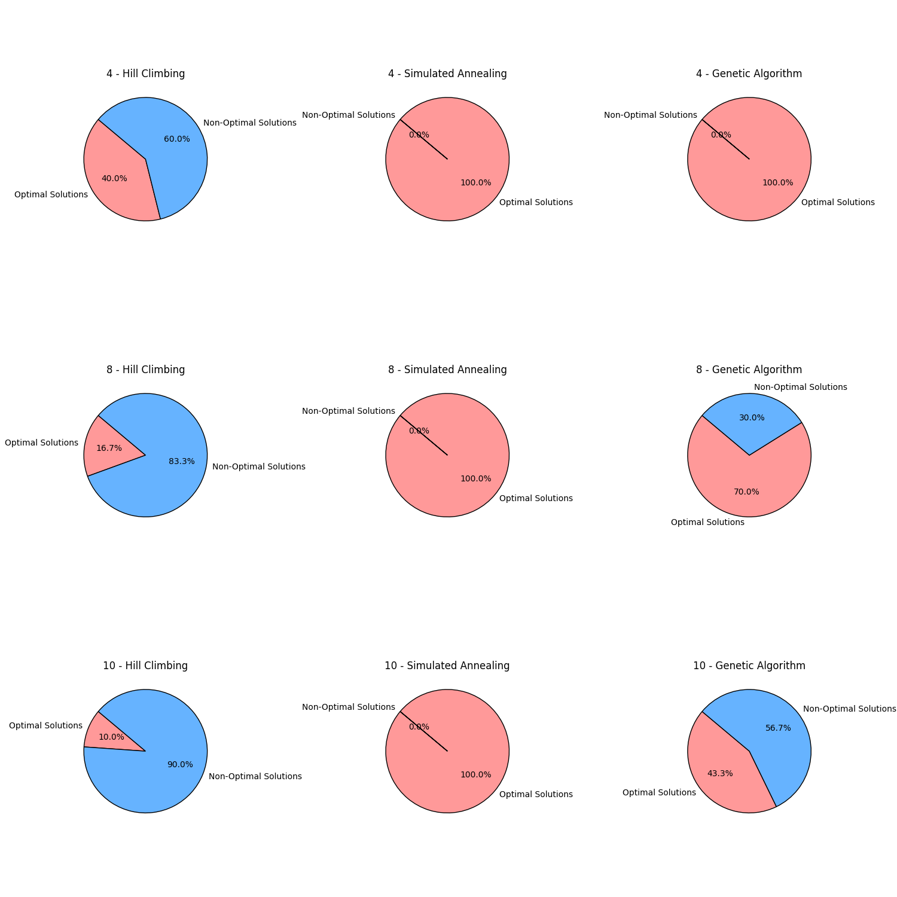
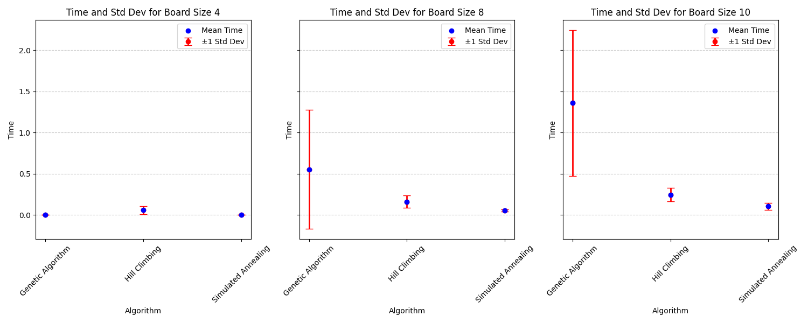
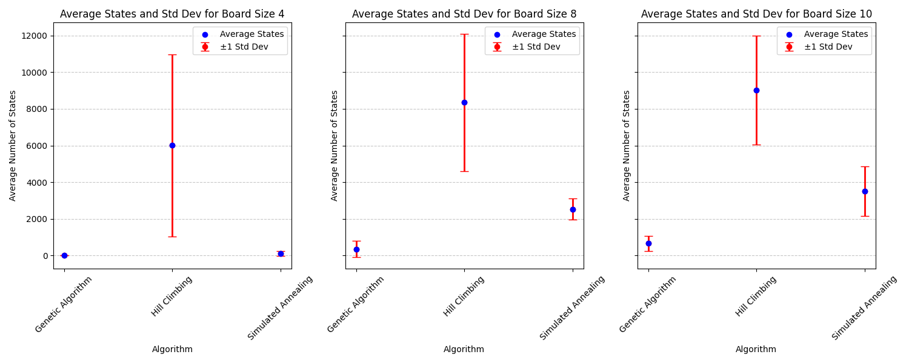
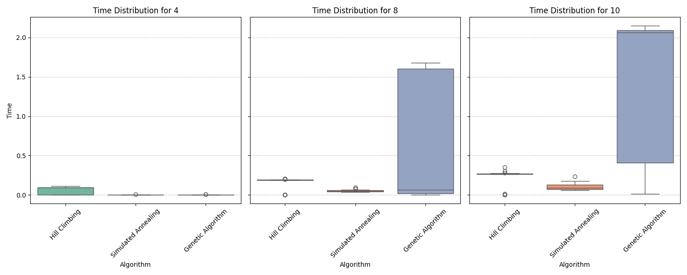
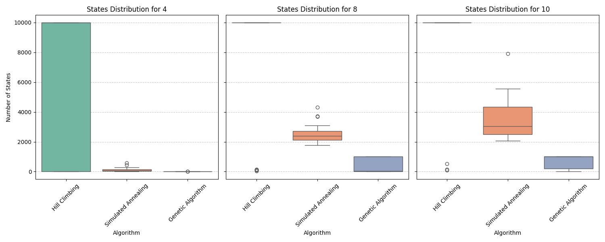

**Introducción**

El problema de las N-reinas consiste en ubicar N reinas en un tablero de ajedrez de tamaño NxN de tal manera que ninguna reina se amenace entre sí. Es decir, ninguna reina debe compartir la misma fila, columna o diagonal con otra. Este problema es un caso clásico de problemas de optimización combinatoria, y es utilizado frecuentemente para poner a prueba algoritmos de búsqueda local debido a su complejidad creciente a medida que aumenta el tamaño del tablero.

Se implementaron tres algoritmos de búsqueda local: **Hill Climbing**, **Simulated Annealing** y **Algoritmos Genéticos**, con el fin de encontrar una solución válida al problema de las N-reinas. Se realizaron múltiples experimentos con diferentes tamaños de tablero (4, 8 y 10 reinas), y se evaluaron los algoritmos en función de su capacidad para encontrar soluciones óptimas, el tiempo de ejecución y la cantidad de estados evaluados.

**Marco Teórico**

- **Hill Climbing**

El algoritmo de Hill Climbing es una técnica de búsqueda local que se basa en mejorar progresivamente una solución inicial. A partir de una configuración de reinas en el tablero, el algoritmo evalúa los estados vecinos, es decir, configuraciones que se obtienen al mover una reina a una posición diferente en la misma columna. El objetivo es encontrar una solución que minimice la función objetivo H(e), que cuenta el número de pares de reinas que se amenazan entre sí. Hill Climbing se detiene cuando no se puede mejorar más la solución actual, lo que puede llevar a soluciones subóptimas debido a la posibilidad de quedar atrapado en óptimos locales.

- **Simulated Annealing**

Simulated Annealing es un algoritmo inspirado en el proceso físico de recocido, donde un material se calienta y luego se enfría lentamente para alcanzar un estado de baja energía. En el contexto de las N-reinas, el algoritmo comienza con una configuración inicial y permite transiciones hacia estados peores (con más pares de reinas amenazadas), con una probabilidad que disminuye con el tiempo. Esta capacidad de aceptar soluciones peores ayuda al algoritmo a escapar de óptimos locales, lo que puede resultar en una mayor probabilidad de encontrar soluciones óptimas.

- **Algoritmos Genéticos**

Los algoritmos genéticos son una técnica de búsqueda basada en los principios de la evolución natural. En este enfoque, se trabaja con una población de posibles soluciones (individuos) y se aplican operadores como selección, cruce (crossover) y mutación para generar nuevas soluciones a partir de las existentes. En el problema de las N-reinas, cada individuo representa una posible configuración del tablero, y la función de aptitud (fitness) evalúa cuántas reinas se amenazan entre sí. A través de iteraciones, la población evoluciona hacia configuraciones que minimizan la función objetivo H(e), en busca de una solución donde ninguna reina esté amenazada.

* Poblacion : Lista de tamaño n siendo n la longitud del tablero

* Seleccion : Ordenamos la poblacion de menor a mayor en comparacion a la funcion "H" (pares de reinas atacadas) , escogiendo las dos primeras.

* Crosover : se elige al azar entre los 10 primeros individuos de la poblacion y se cruzan , partiendo al individuo(solucion) en dos partes de 0 a N elegidas de manera aleatoria y al final se le agrega una mutacion proporcional a un ratio fijo.

**Diseño Experimental**
- **Tamaños de Tablero:** Se realizaron experimentos con tableros de 4, 8 y 10 reinas.
- **Número de Ejecuciones:** Cada algoritmo se ejecutó 30 veces por tamaño de tablero, en el caso de las busqueda locales hasta un maximo de 10000 estados y en el algoritmo genetico un maximo de 1000 generaciones.
- **Métricas Analizadas:** Número de soluciones óptimas encontradas, tiempo de ejecución promedio, cantidad de estados visitados, y su desviación estándar.

**Análisis y Discusión de Resultados**

El porcentaje de veces que se llega a un estado de solucion optima

El tiempo de ejecucion promedio y la desviacion estandar para encontrar dicha solucion

La cantidad de estados previos promedio, y su desviacion estandar, por los que tuvo que pasar para llegar a una solucion

Funcion H(e) en un entorno 8x8

**Conclusiones**

