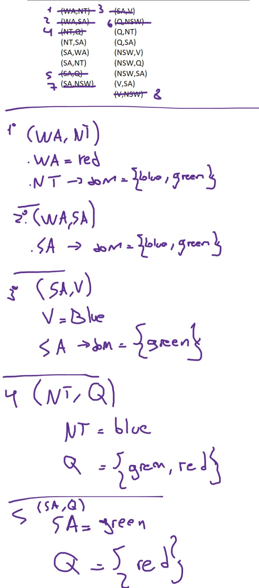
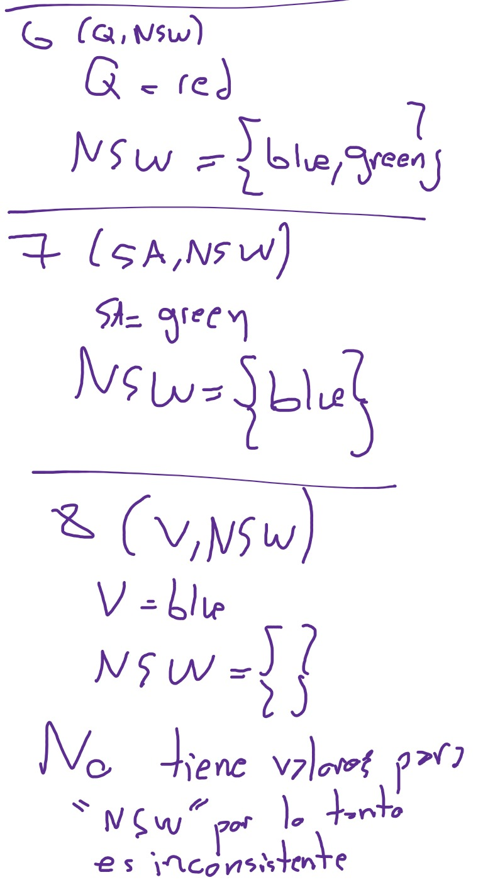
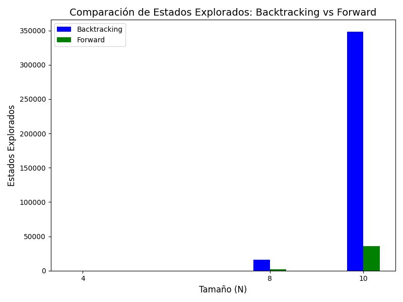
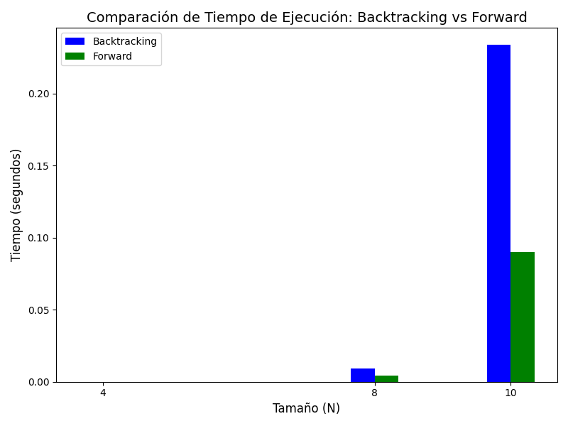

# Ejercicio 1
Tablero 9x9:

Variables = {x_1,---,x_n} n = 9x9.

Dominio = {0,---,9} para cada una de las variables

Restricciones = {(cada subcuaricula 3x3 no debe contener valores identicos),(la fila y columna no deben repetir el numero asignado en la posicion i , j) con i,j <= n}

# Ejercicio 2

# Ejercicio 3
Si cambiamos el dominio de una variable, tenemos que añadir de nuevo a la cola todas las restricciones que actúan sobre la variable. En el peor de los casos, esto puede ocurrir D veces. Hay 2e restricciones en el problema (las originales + sus inversas) que podrían añadirse a la cola.

Esto son 2ED llamadas a la función make_consistent . make_consistent hará d2 comprobaciones.

Así que la complejidad total del algoritmo AC3 es 2ED multiplicado por d2, que es 2ED3

Por lo tanto, decimos que la complejidad de AC3 es O(ED3).

# Ejercicio 4
Se podria lograr con utilizando una estructura que guarde la consistencia de X_k , X_i (matriz).

al iniciar el algoritmo se deberia contar la cantidad de valores consistentes, luego al ejecutar AC3 y remover un valor del dominio x_i , se actualiza la matriz.

como n es el numero de variables y d el dominio, la matriz seria de tama;o n*d, pero al realizar las comprobaciones de consistencia tendriamos que recorrer la matriz por ello n^2 * d^2.

# Ejercicio 5

### a) 2-consistencia implica n-consistencia en un árbol

Primero, hay que recordar que en un CSP, la **2-consistencia** significa que, para cada par de variables \(X_i\) y \(X_j\), cualquier valor en el dominio de \(X_i\) debe tener un valor correspondiente en el dominio de \(X_j\) que satisfaga la restricción entre ellos. En un árbol, todas las variables están conectadas de manera que no existen ciclos.

Ahora, demostraremos que si un CSP es 2-consistente, entonces es n-consistente. Para ello, consideremos un árbol con \(n\) variables.

1. **Base de inducción**: Para un árbol con una sola variable \(X_1\), es trivialmente n-consistente, ya que no hay otras variables con las que satisfacer restricciones.

2. **Paso inductivo**: Supongamos que el resultado es cierto para un árbol de \(k\) variables (2-consistencia implica k-consistencia). Consideremos un árbol con \(k+1\) variables. Al ser un árbol, podemos seleccionar una variable raíz \(X_r\) y dividir el árbol en subárboles.

   - Para cada subárbol que contiene \(X_r\) y una variable adyacente \(X_i\), la 2-consistencia asegura que podemos asignar valores a \(X_r\) y \(X_i\) que satisfacen las restricciones entre ellas.
   - Luego, cada subárbol conectado a \(X_i\) (que no incluye \(X_r\)) también es un árbol de variables. Por la hipótesis de inducción, podemos extender las asignaciones desde \(X_i\) a las demás variables en su subárbol, garantizando que las restricciones son satisfechas.

   Este proceso se repite para todas las variables del árbol. Por lo tanto, si el árbol es 2-consistente, se puede asignar un valor a cada variable de manera que todas las restricciones se satisfacen, logrando así n-consistencia.

### b) Justificación de la suficiencia de 5a

La demostración de que 2-consistencia implica n-consistencia en árboles es suficiente porque:

- **Estructura del árbol**: En un árbol, cada variable tiene una estructura jerárquica sin ciclos. Esto significa que, al establecer la 2-consistencia, se garantiza que las restricciones locales se satisfacen, lo que se traduce en la posibilidad de extender estas asignaciones a lo largo de todo el árbol sin romper ninguna restricción.
- **Propiedades de propagación**: Dado que la propagación de consistencia en un árbol se produce a través de los nodos conectados (donde cada nodo solo tiene conexiones hacia sus vecinos), aseguramos que cada ajuste en un nodo afecta directamente a sus vecinos, propagando la consistencia a lo largo de toda la estructura.

Por lo tanto, demostrar que 2-consistencia implica n-consistencia es suficiente para validar la correctitud del algoritmo CSP en árboles estructurados, ya que asegura que todas las variables del problema pueden ser asignadas de forma coherente y satisfactoria dentro de las restricciones dadas.

# Ejercicio 6 , 7 

Se implemento backtracking y foward checking en tableros de tama;o N = 4,8,10 para comparar resultados.

Se puede observar que la propagacion de restricciones reduce bastante el dominio de forward conrespecto a los estados que necesita backtracking para llegar a la solucion

Se observa que la ejecucion forward es mas rapida conrespecto a la de backtracking

## Conclusiones 
tanto backtracking como foward checking siempre encontraron solucion, pero foward se mostro siempre mas eficiente que su contraparte.

# Comparativa
Si se realiza una comparativa con los algoritmos del TP5 filtrando aquellos que llegaron a una solucion, simulated annealing es mas rapido y consume menos estados, le seguiria foward checking ya que con la propagacion de restricciones agiliza bastante el resultado.