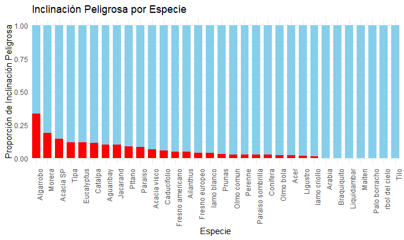
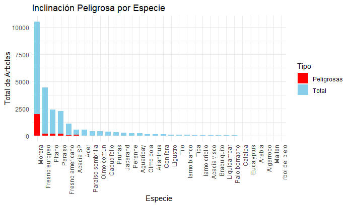
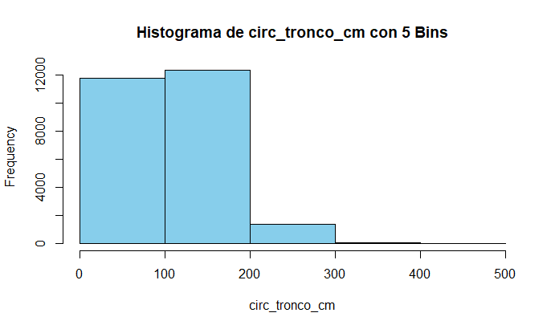
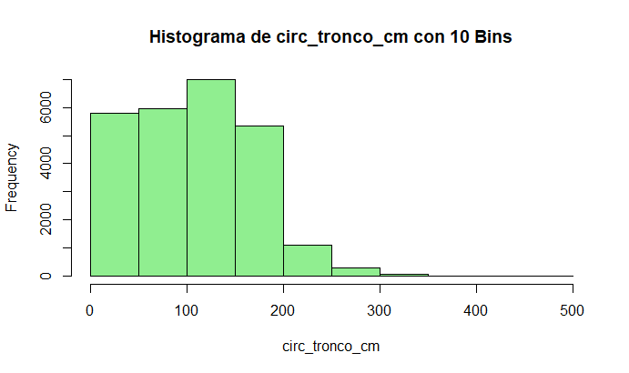
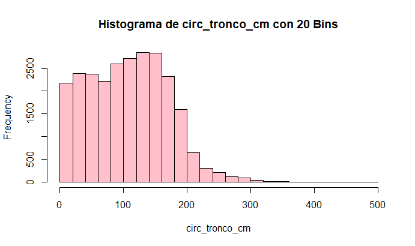
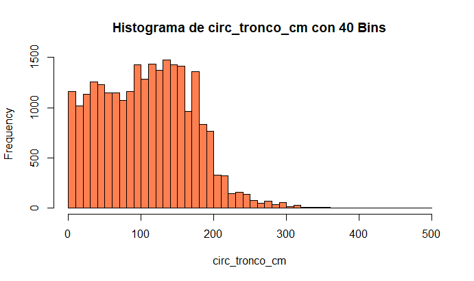
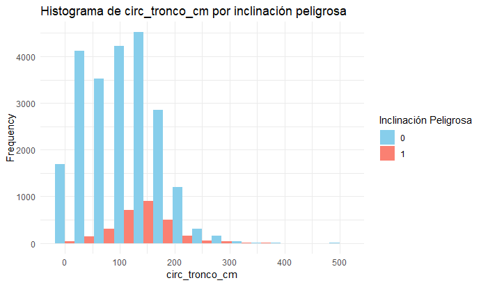

# 2. (a)

# 2. (b)

Se puede observar que hay secciones mas peligrosas que otras

# 2. (c)

Se puede considerar que existe una especie mas peligrosa que otras, se observa que el algarrobo tiene mayor proporcion a pesar de los pocos datos de este
# 3. (b)

# 3. (c)

# 3. (d)
Como criterio de corte se usaron los cuartiles de la variable circ_tronco_cm donde:

    1 cuartil : bajo
    2 cuartil : medio
    3 cuartil : alto
    4 cuartil : muy alto