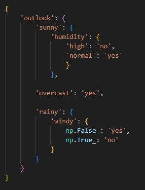

## Resultados

## Estrategias sobre decisiones de tipo real
### 1. **Uso de umbrales en datos continuos**
Los árboles de decisión dividen los datos continuos utilizando **umbrales** específicos. Estos umbrales separan los valores menores y mayores que un valor determinado, lo que permite dividir el conjunto de datos en subgrupos. La elección del umbral adecuado se basa en métricas como la **varianza** (en regresión) o el **índice Gini** y **entropía** (en clasificación).

### 2. **Crecimiento del árbol y selección de características**
El algoritmo evalúa todas las características y selecciona aquella que mejor divide los datos según un criterio (como la minimización de la varianza en regresión). En los datos continuos, esto implica explorar todas las posibles particiones y elegir la que maximice la homogeneidad en los nodos.

### 3. **Corte de los árboles**
La poda se utiliza para evitar el **sobreajuste**. En árboles profundos, que tienden a ajustarse demasiado a los datos de entrenamiento, se eliminan ramas innecesarias que no contribuyen significativamente a la predicción. Esto se puede hacer de forma post-poda, usando validación cruzada para determinar qué ramas cortar.

### 4. **Regresión con árboles de decisión**
En regresión, los árboles de decisión predicen un valor continuo en lugar de una clase. La división de los datos se basa en la **varianza** o el **error cuadrático medio**, buscando particiones que minimicen la variabilidad dentro de los nodos, en lugar de maximizar la homogeneidad en clases.